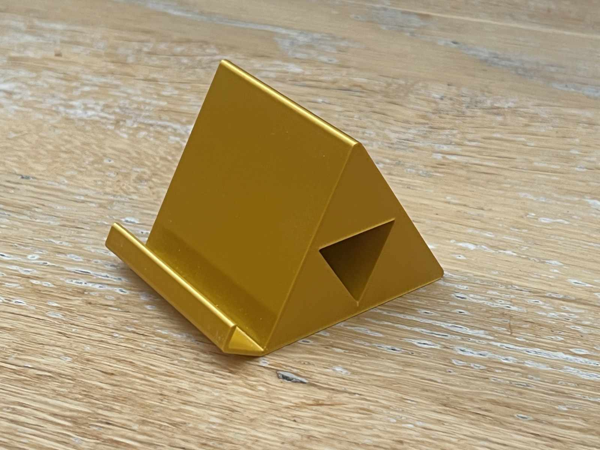

# Triforce phone stand

A Triforce phone stand.

I was looking for a phone stand, but couldn't find one that I liked. I explored triangles, as they are strong and stable and was inspired by the Triforce, a fictional artifact in Nintendo's The Legend of Zelda video games.

I charge my phone in it, and it's very stable. It's good for StandBy mode.

It's an easy print without supports.

I used OnShape to sketch it out.

https://www.printables.com/model/1165287-triforce-phone-stand

## License

CC0

## Author

Leon Brocard <acme@astray.com>
